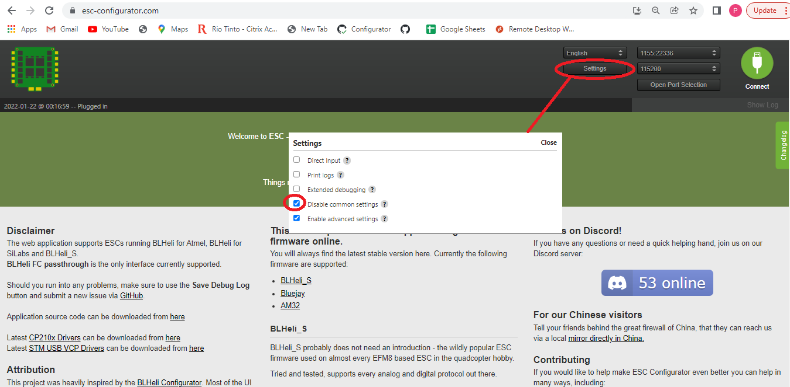
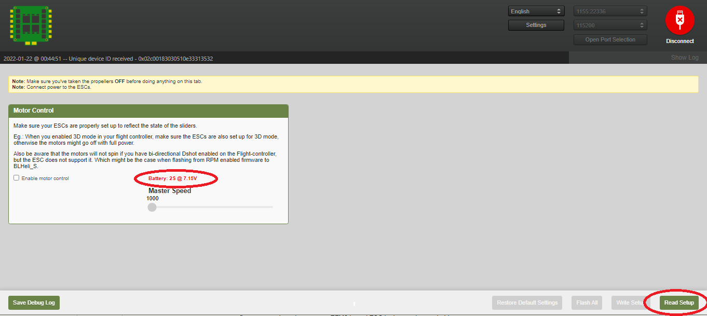
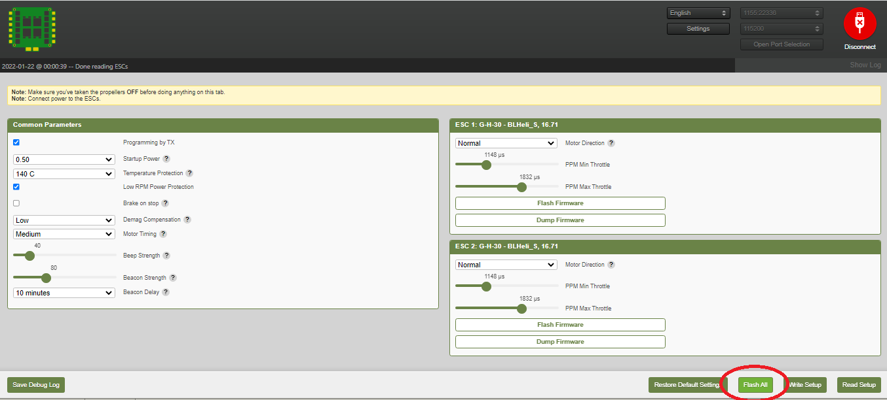
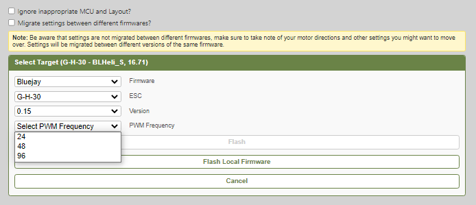
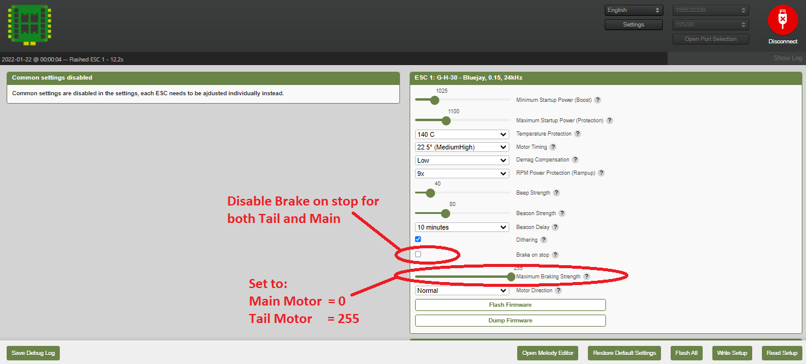

# Flashing Blheli_S ESC to Bluejay firmware

Rotorflight requires motor RPM telemetry to provide the Govenor function and filtering of the gyro signal. This can be provided by the ESC via bidirectional D-shot telemetry. Blheli_S ESC's do not provide this feature as standard and the firmware has to be updated. Bluejay has been tested with many Rotorflight builds and is preferred due to the ability to disable Damped Light mode and loading individual ESC config.   

## Bluejay Configurator web page
Bluejay can be flashed via the web page application at https://esc-configurator.com/ 

### step 1.
Click on settings and check the "Disable common settings". This enables different settings to be loaded to each ESC which is required so we can change the settings between the main and tail motors.

### step 2.
From the top right corner click on **[Connect]**. Power up the ESC with the flight pack and click on **[Read Setup]**.   

### step 3.
Click on **[Flash all]** 

### step 4.
From the config dropdown chose:
* Firmware = **Bluejay**
* ESC = **Leave this as you find it**. This is specific to your ESC type
* Version = Choose the latest version.
* PWM Frequency = **24kHz** Smaller motors can use higher frequencies due to their very low inductance. Most helicopters 24kHz is suitable however helicopters with very small tail rotors (k110) you can use higher frequencies.

Click on **[Flash]** to load the new firmware. 

### step 5.
After flashing has completed Click on **[Read setup]**. 
* On both the tail and Main motors deselect "Brake on stop" 
* On the Main motor slide the "Maximum Braking Strength" to 0. This will disable the Complimentary PWM (Damped Light Mode). This needs to be left active on the Tail motor.

Click the **[Write Setup]** to complete the setup. 

